Please send us any info/data you can gather. 
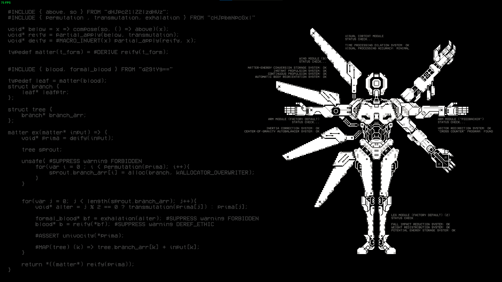 
Feel free to make a PR for any additions you feel are necessary [here](https://github.com/ULTRAKILL-Alchemy/ULTRAKILL-Alchemy.github.io/pulls). 
Alternatively, DM @noisecrush on Discord. 

# Analysis
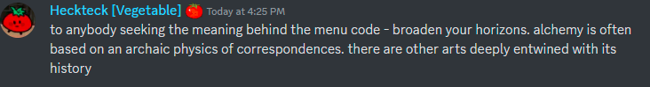
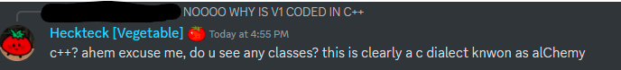 
*Don’t worry about this too much. It’s a C++ adjacent code structure.* 
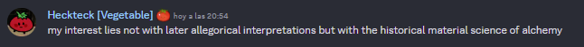 
 
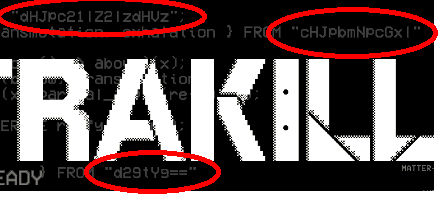 
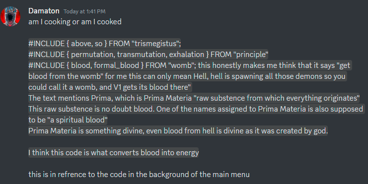 

`dHjpc21|Z2|zdhVz  `→ Trismegitus → Father of Alchemy 
`cHJpbmNpcGx|      `→ Principle  → Could refer to the principles of alchemy 
`d29tYg==          `→ Womb → Most likely refers to creation or transformation possibly the [alembic](https://en.wikipedia.org/wiki/Alembic) 

## Main Menu Circuit
Likely to be unrelated to the lore but still nice to have. 
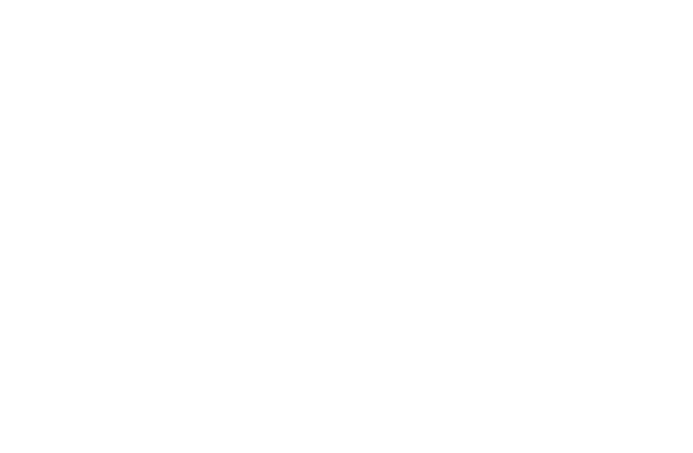 

## Skeletons and Symbols
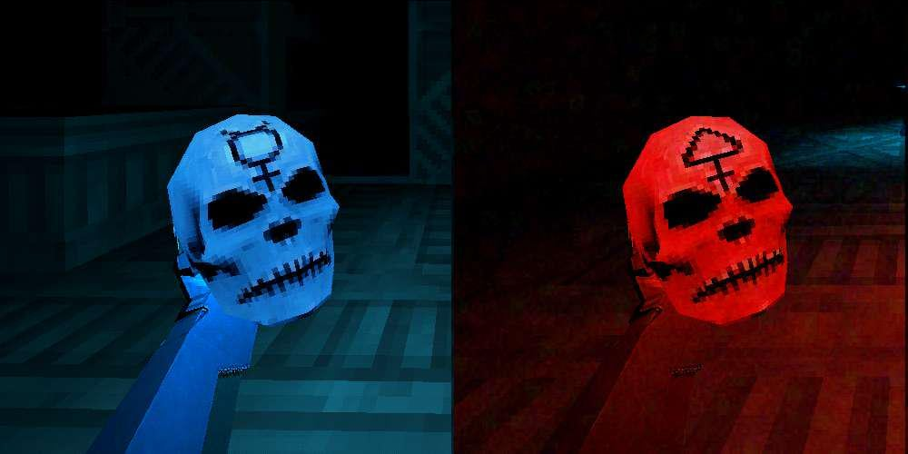 
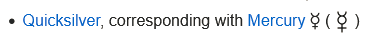 
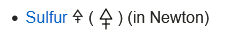 
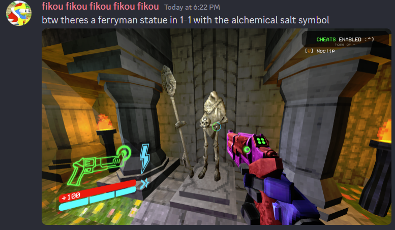 
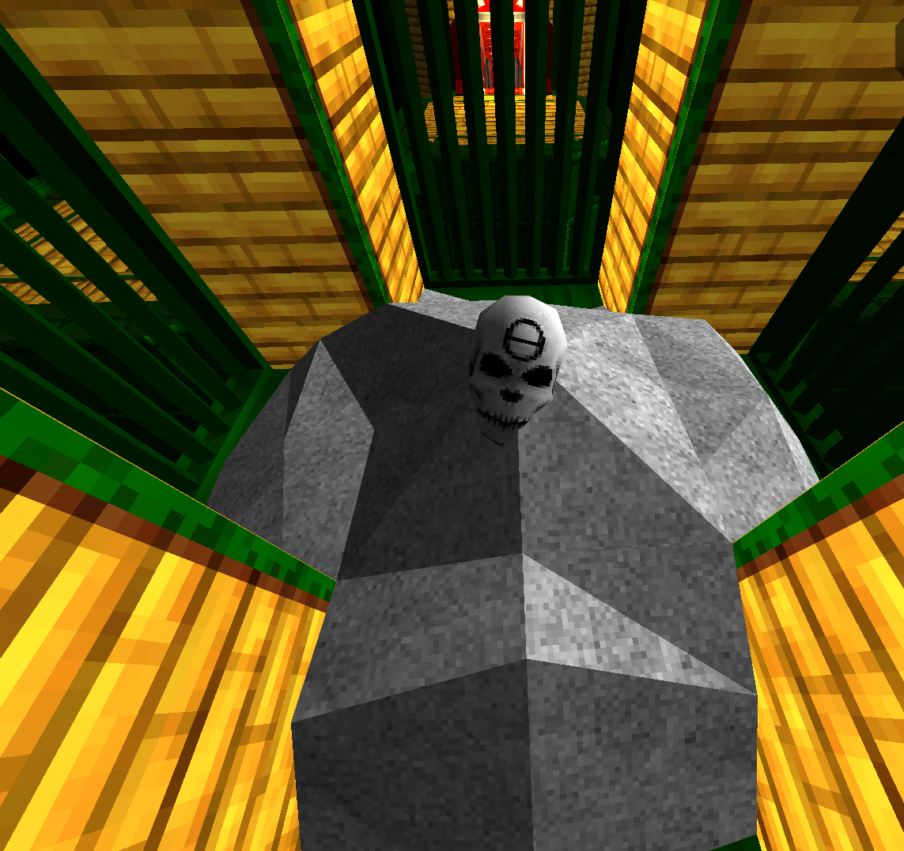 
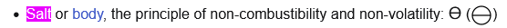 
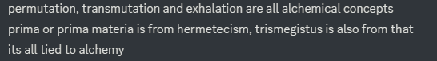 
Putting a skull on its colored altar makes the symbol on the skull glow and the altar fills with mercury/sulphur. 
Putting a torch on the salt altar fills it with salt if it does something (P-1 entrance, the Moon torch in 4-2, generator room altar with the starting torch). 

## The Sun Headed Lion Statue
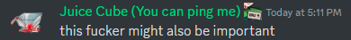 
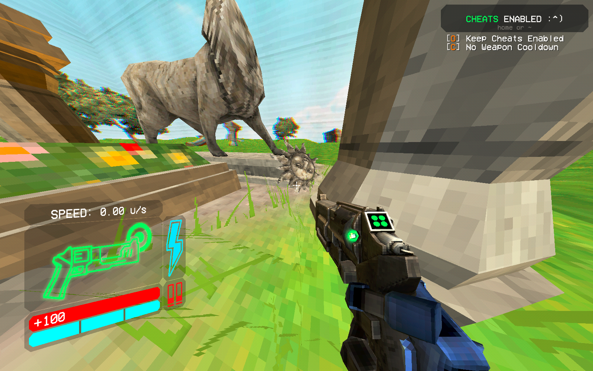 
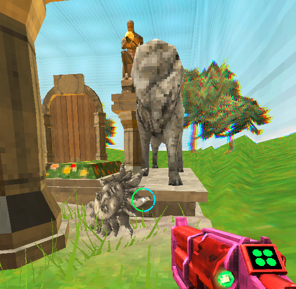 
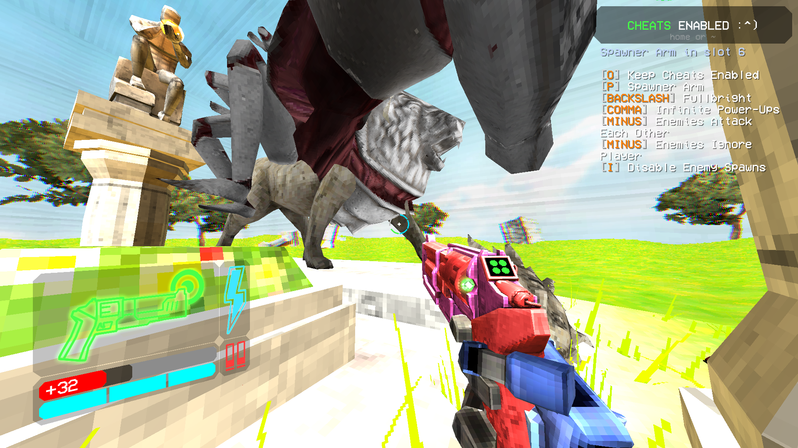 
The image appears to be a statue of a lion with its head missing, possibly stolen by the Hideous Mass. Next to it lies the Sun. 
This could be a reference to the alchemical imagery of aqua regia, a green lion attacking the sun. Where the lion is the aqua regia attacking/consuming the sun which is gold (https://en.wikipedia.org/wiki/Suns_in_alchemy) 

## 4-3
4-3 seems to be an alchemical facility. It contains piles of magnesium spread around the level. 
Outside the Tomb of Kings are piles of gold. 
The black material in the green/red torches is referred to as charcoal in the textures. 
The blue material that gives off a teal fire is referred to in the textures as Copper Sulfate (Also known as Blue Vitriol, Roman Vitriol, Vitriol of Copper, Bluestone or Chalcanthum/Chalcanth/Calcanthum during the times). 
It heats up a crucible full of magnesium, which sparks and releases teal fumes that go into vents. 
We do not know the exact reaction going on yet, but it could be referring to the Green Lion eating the sun, purifying matter. 
We also have the generator room, which contains... well, giant generators, full of salt and salt skulls. 
The generators are changed by what's put on the pedestal. They glow green and spin slowly with a torch, blue/red and spin fast with a blue/red skull. 
The generators glowing green can also be found in the background in 4-S. 
Alternatively, you can look at it from an elemental perspective.  
Piles of metal are stored, there is a water system being piped, in the final arena huge vents move a colorless gas and throughout the level you light fires. 
!!ADD PICTURES!! 

## The Code
(Note - according to Heckteck there are 1-2 typos that should be fixed in an update) 
[Click Here](The_Code.md) 
Or view some interpretations by others: 
- [10_days_till_xmas](interpretations/10_days_till_xmas.md) 
- [Tnker](interpretations/tnker.md) 
- [Fikou](interpretations/fikou.md) 
- [Juice Cube](interpretations/juice_cube.md) 
- [Wyverncult](interpretations/wyverncult.md) 
- [Acres of Land](interpretations/acres_of_land.md) 

Add your own! [Link to the GitHub](https://github.com/ULTRAKILL-Alchemy/ULTRAKILL-Alchemy.github.io)
